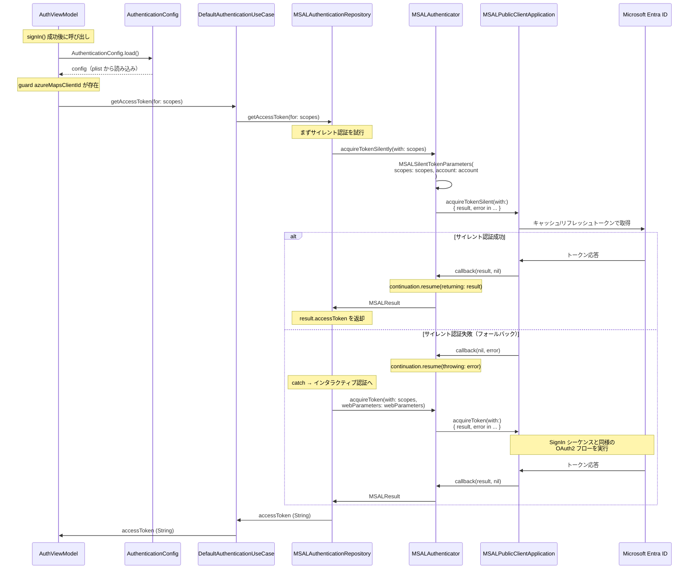
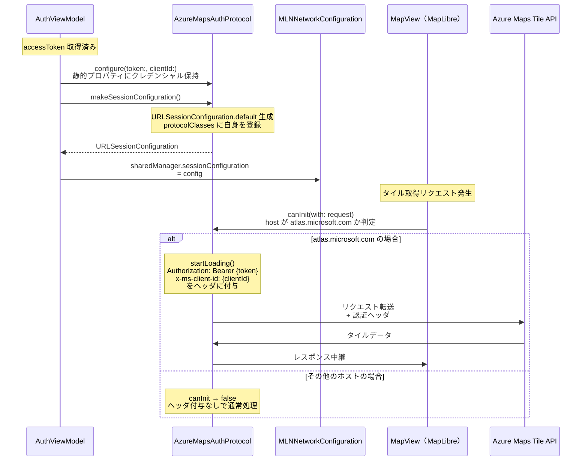

# Azure Maps 認証設定 シーケンス図

SignIn 成功後に `setupMapAuthentication` が呼ばれ、
MSAL でアクセストークンを取得し MapLibre の HTTP ヘッダに設定するまでの流れを示す。

## Part 1: トークン取得

サイレント認証でアクセストークンを取得する流れ。
サイレント認証失敗時はインタラクティブ認証にフォールバックする。

## Part 2: URLProtocol による認証ヘッダ付与

`AzureMapsAuthProtocol`（カスタム URLProtocol）を使い、
`atlas.microsoft.com` へのリクエストのみに認証ヘッダを付与する流れ。

