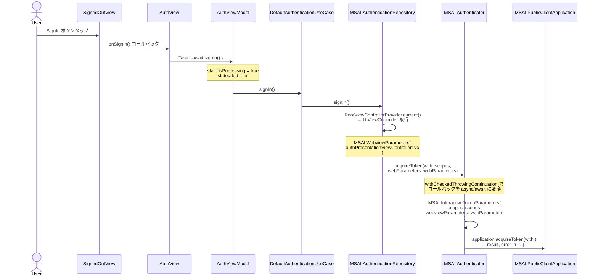
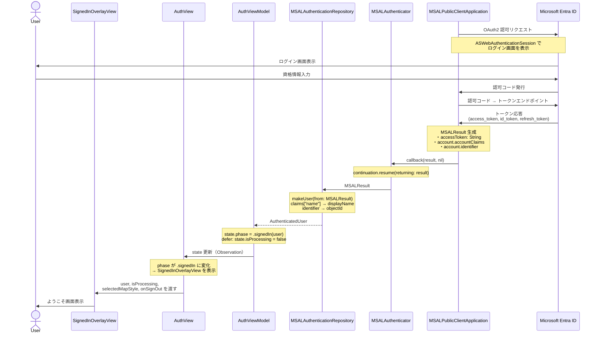
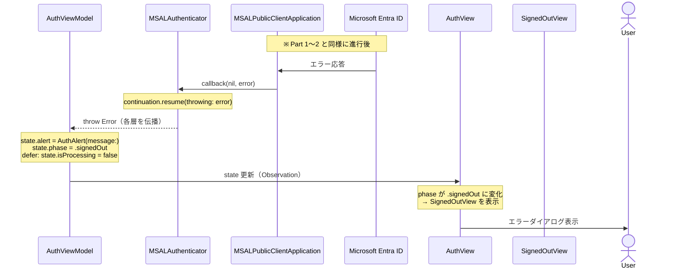

# SignIn シーケンス図

SignedOutView の SignIn ボタン押下から、MSAL ライブラリ経由で Microsoft Entra ID 認証を行い、
ユーザ情報を取得・表示するまでの流れを示す。
Azure Maps 認証設定（`setupMapAuthentication`）については別図を参照。

## Part 1: アプリ → MSAL SDK 呼び出し

SignIn ボタンタップからクリーンアーキテクチャの各層を経由し、
MSAL SDK の `acquireToken` を呼び出すまでの流れ。

## Part 2: Entra ID 認証 → ユーザ情報取得

MSAL SDK が Entra ID と通信し、認証結果を受け取ってから
`AuthenticatedUser` を生成して UI に反映するまでの流れ。

## エラー系

認証失敗時（ユーザキャンセル・資格情報不正等）の流れ。

